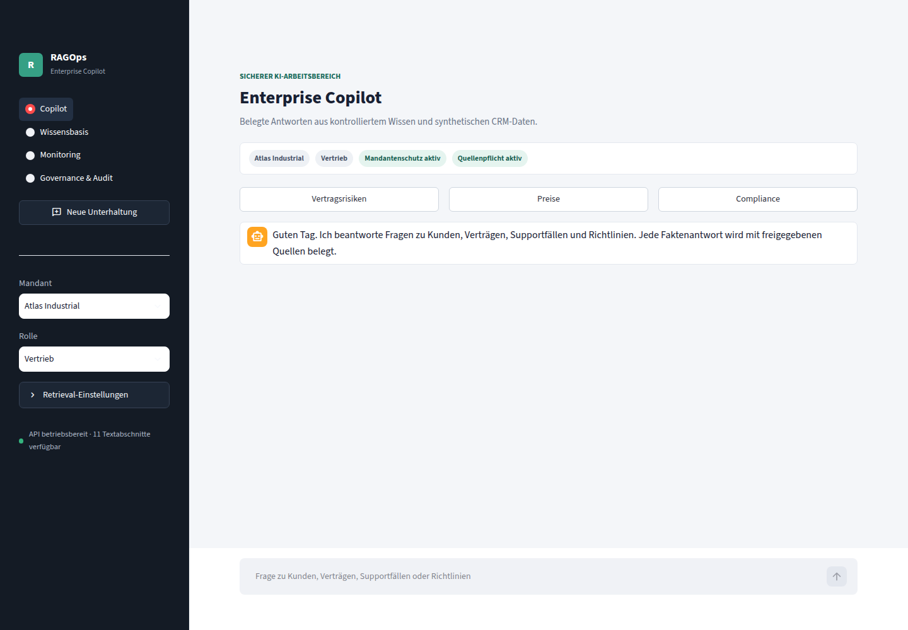
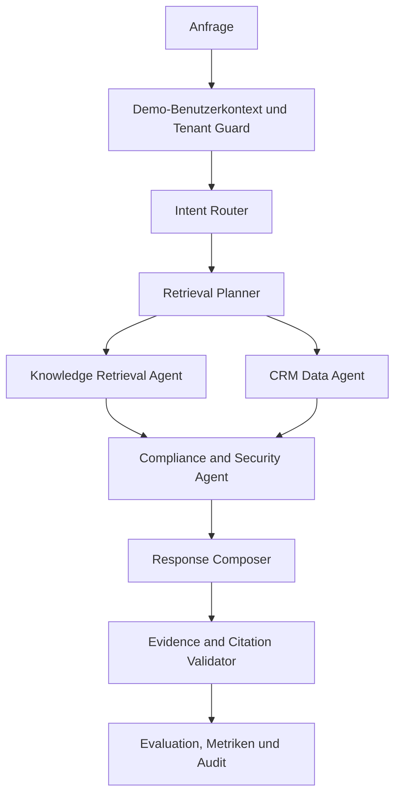

# RAGOps Enterprise Copilot

> **Produktisierungsstand: 0.2.0.dev0 — kein Release Candidate.**
> Phase 0 ist dokumentiert; die Persistenzgrundlage ist vorbereitet, aber noch
> nicht ausführungsgeprüft oder an die API angeschlossen. Produktionsstart ist
> gesperrt. OpenAI/Azure-Generierung ist bisher nicht implementiert.
> Audit, Blocker und nächste Schritte: [Produktisierungsaudit](docs/PRODUCTIZATION_AUDIT.md),
> [Datenbank](docs/DATABASE.md), [Produktionsstatus](docs/DEPLOYMENT_PRODUCTION.md).
> `make product-verify` liefert einen fehlgeschlagenen Freigabestatus, solange
> Pflichtprüfungen fehlen oder nicht ausgeführt werden können.


[](https://github.com/ghostvenumai/ragops-enterprise-copilot/actions/workflows/ci.yml)

**RAGOps Enterprise Copilot** ist eine lokal ausführbare Referenzplattform für
abgesichertes Enterprise-RAG, typisierte Multi-Agent-Workflows und
nachvollziehbare AI-Governance. Das Portfolio-Projekt verbindet synthetische
Unternehmensdokumente mit synthetischen CRM-Daten und erzeugt ausschließlich
belegte Antworten mit Quellenangaben.

Der Standardbetrieb benötigt weder einen API-Schlüssel noch einen
kostenpflichtigen LLM-Zugang. Ein deterministischer Testprovider ermöglicht
reproduzierbare Demos, Sicherheitsprüfungen und Retrieval-Evaluationen.

> Alle Kunden-, Vertrags-, Ticket- und Dokumentdaten sind ausdrücklich
> synthetisch. Das Repository enthält keine produktiven Daten oder Zugangsdaten.



## Was das Projekt demonstriert

- Enterprise-RAG mit Volltext-, Vektor- und hybrider Suche
- mandanten- und rollenbasierte Zugriffskontrolle
- typisierte, begrenzte Multi-Agent-Orchestrierung
- Retrieval aus Wissensdokumenten und strukturierten CRM-Daten
- Quellenpflicht und serverseitige Citation-Validierung
- kontrollierte Antwortverweigerung bei fehlender Evidenz
- Erkennung widersprüchlicher oder veralteter Quellen
- Prompt-Injection-Erkennung und PII-Maskierung
- Audit-Logging, Korrelations-IDs, Kosten- und Latenzmetriken
- lokale Provider-Abstraktion sowie Konfigurationsstubs für OpenAI und Azure OpenAI
- reproduzierbare Evaluation, gehärtete Container und CI/CD
- einen kontrollierten, wiederaufnehmbaren Codex-Entwicklungsloop

## Fachliches Szenario

Die Demo bildet ein fiktives B2B-Unternehmen mit drei Mandanten beziehungsweise
Geschäftsbereichen ab. Die Wissensbasis enthält Produktunterlagen,
Support-Richtlinien, Preislisten, Verträge, Vertriebsleitfäden,
Compliance-Vorgaben und synthetische CRM-Datensätze.

Eine typische Anfrage lautet:

> Welche Enterprise-Kunden haben offene kritische Supportfälle und gleichzeitig
> einen Vertrag, der innerhalb der nächsten 60 Tage ausläuft? Welche Maßnahmen
> sollte der Vertrieb einleiten?

Das System prüft Benutzerrolle und Mandant, plant die Suche, kombiniert
Dokument- und CRM-Evidenz, filtert unzulässige Inhalte und liefert eine Antwort
mit Quellen, Evidenzwert und Laufzeitdaten. Liegt keine ausreichende Evidenz
vor, wird die Antwort kontrolliert verweigert.

## Systemablauf



Die Agenten tauschen keine uneingeschränkten Freitextbefehle aus. Der Workflow
arbeitet mit typisierten Zuständen, festen Übergängen, einem Iterationslimit und
expliziten Fehler- und Abstention-Zuständen.

## Antwortentstehung

1. **Mandanten- und Rollenprüfung:** Die Anfrage wird gegen den Benutzerkontext geprüft.
2. **Intent Routing:** Der Router unterscheidet Wissens-, CRM-, Vertrags-, Support- und Compliance-Anfragen.
3. **Retrieval-Planung:** Top-K, Filter und benötigte Datenquellen werden bestimmt.
4. **Hybride Suche:** Volltext- und deterministische Vektorsignale werden zusammengeführt.
5. **Reranking:** Titel, Metadaten, Aktualität und lexikalische Überdeckung bestimmen die Reihenfolge.
6. **Sicherheitsprüfung:** Prompt-Injection-Muster und personenbezogene Daten werden erkannt.
7. **Antwortkomposition:** Der Provider formuliert nur aus freigegebenen Evidenzteilen.
8. **Citation-Validierung:** Tatsachenbehauptungen ohne Quelle führen zur Ablehnung.
9. **Audit und Telemetrie:** Korrelation, Latenz, Token, Kosten und Security Events werden erfasst.

## Deutsche Benutzeroberfläche

Die Streamlit-Anwendung ist keine statische Kennzahlenseite, sondern eine
deutschsprachige Copilot-Arbeitsoberfläche mit vier Bereichen:

- **Copilot:** Chat, Beispielanfragen, Quellen, Evidenzscore und Antwortmetriken
- **Wissensbasis:** mandantengefilterter Dokumentbestand und Index-Aktualisierung
- **Monitoring:** Systemstatus, Retrieval-Qualität, Kosten und Konfigurationsvergleich
- **Governance & Audit:** Sicherheitskontrollen, Erkennungen und Audit-Ereignisse

Die Auswahl von Mandant und Rolle ist eine sichtbare Demo-Funktion. In einer
Produktivumgebung müssen beide Werte aus verifizierten Identity-Provider-Claims
stammen und dürfen nicht durch den Client frei gesetzt werden.

## Schnellstart

Voraussetzungen sind Python 3.12, `make` und für den vollständigen Stack Docker
mit Docker Compose.

```bash
git clone https://github.com/ghostvenumai/ragops-enterprise-copilot.git
cd ragops-enterprise-copilot
make setup
make verify
make build
make up
```

Danach sind erreichbar:

- Copilot: <http://localhost:8501>
- OpenAPI: <http://localhost:8000/docs>
- Metriken: <http://localhost:8000/metrics>
- Readiness: <http://localhost:8000/ready>

Eine deterministische Kommandozeilen-Demo ohne Docker startet mit:

```bash
make demo
```

## Beispielanfrage über die API

```bash
curl -sS http://localhost:8000/v1/query \
  -H 'content-type: application/json' \
  -d '{
    "question": "Welche Enterprise-Kunden haben kritische Supportfälle und bald endende Verträge?",
    "tenant_id": "tenant-alpha",
    "user_id": "portfolio-user",
    "role": "sales",
    "top_k": 5
  }'
```

Die Antwort enthält `answer`, `abstained`, `evidence_score`, `citations`,
Request-Metriken und eine `correlation_id`. Das vollständige API-Modell steht
in [docs/API.md](docs/API.md).

## LLM-Provider

| Provider | Standard | Externer Schlüssel | Zweck |
|---|---:|---:|---|
| `DeterministicTestProvider` | Ja | Nein | Reproduzierbare lokale Tests und Demo |
| `OpenAIProvider` | Nein | Ja | Konfigurationsstub; Generierung ausstehend |
| `AzureOpenAIProvider` | Nein | Ja | Konfigurationsstub; Generierung ausstehend |

Die Konfiguration erfolgt ausschließlich über Umgebungsvariablen. Eine sichere
Vorlage liegt in [.env.example](.env.example); echte `.env`-Dateien sind durch
die Ignore- und Verification-Regeln ausgeschlossen.

## Entwicklung mit kontrolliertem Codex-Loop

Das Repository wurde entlang der in [TASKS.yaml](TASKS.yaml) formalisierten
Phasen und des kontrollierten Loop-Modells entwickelt. Der Loop ist kein
Skript, das beliebigen Modelltext als Shell-Code ausführt. Er ist ein
begrenzter Controller für genau eine klar definierte Aufgabe pro Iteration.

Der Einstiegspunkt ist:

```bash
make loop
```

Er ruft [scripts/autonomous_build.sh](scripts/autonomous_build.sh) und danach
[loop/controller.py](loop/controller.py) auf. Eine Iteration führt folgenden
kontrollierten Ablauf aus:

1. Git-Repository und persistenten Loop-Zustand prüfen
2. `AGENTS.md`, `SPEC.md`, `TASKS.yaml` und das letzte Ergebnis laden
3. genau eine offene Aufgabe mit erfüllten Abhängigkeiten auswählen
4. Aufgabe, Acceptance Criteria und erlaubte Dateibereiche in einen begrenzten Prompt überführen
5. ausschließlich den fest definierten Codex-Aufruf starten
6. Quality Gates und separaten Reviewer als feste Kommandolisten ausführen
7. Ergebnis, Laufzeit, Fehler und Fortschritt atomar speichern
8. bei Fehler-, Stillstands-, Zeit- oder Security-Limits kontrolliert stoppen

Der Codex-Aufruf ist fest vorgegeben:

```bash
codex exec \
  --sandbox workspace-write \
  --ask-for-approval never \
  "<klar begrenzte Iterationsaufgabe>"
```

### Sicherheitsgrenzen des Loops

- kein `--yolo` und kein `danger-full-access`
- kein Extrahieren oder Ausführen von Shell-Code aus Modellantworten
- feste Codex-, Quality- und Review-Kommandos
- Workspace-Sandbox statt unbeschränktem Hostzugriff
- genau eine priorisierte Aufgabe pro Controller-Aufruf
- atomare Zustandsdateien für einen sicheren Wiederanlauf
- Zeit-, Iterations-, Fehler-, Stillstands- und Loggrößenlimits
- separater Review-Pass nach der Implementierung
- Abbruch bei kritischem Security-Fund

Der wiederaufnehmbare Zustand liegt unter `.loop/`:

```text
.loop/state.json
.loop/history.jsonl
.loop/current_task.json
.loop/last_result.json
.loop/blockers.json
.loop/logs/
```

Status und Wiederaufnahme:

```bash
make loop-status
make loop-resume
```

**Nachweisgrenze:** Die versionierte Historie enthält einen ausgeführten
Sicherheits-Dry-Run des Controllers. Die abgeschlossenen Entwicklungsphasen,
Tests und Reviewergebnisse sind in `TASKS.yaml` und `evidence/` dokumentiert.
Das Repository behauptet bewusst nicht, dass jede Codezeile in einer vollständig
autonomen End-to-End-Ausführung erzeugt wurde. So bleibt der Automationseinsatz
prüfbar, ohne Modellaktivität oder Messwerte zu erfinden.

Details: [docs/LOOP_ARCHITECTURE.md](docs/LOOP_ARCHITECTURE.md).

## Autonomer Application- und Video-Build

Neben dem aufgabenbezogenen Codex-Entwicklungsloop besitzt das Repository einen
zweiten, vollständig deterministischen Master-Loop. Er prüft die echte
Anwendung, startet eine reproduzierbare Demo, nimmt definierte GUI-Zustände auf,
erzeugt deutschen Sprechertext, validiert ihn vor TTS gegen Code, Demo und
Timing, rendert das Video mit FFmpeg und prüft das Ergebnis technisch.

```bash
# Planung, Abhängigkeiten und Timeline ohne Aufnahme prüfen
./run_loop.sh --dry-run

# Vollständiger Application-/Demo-/Video-Ablauf
./run_loop.sh

# Nach Behebung eines externen Blockers ab der offenen Phase fortsetzen
./run_loop.sh --resume
```

Die Phasen reichen von `DISCOVER`, `STATIC_CHECK`, `UNIT_TEST` und
`SECURITY_CHECK` über `APPLICATION_QA`, `RECORD`,
`VERIFY_NARRATION`, `GENERATE_VOICE` und `RENDER` bis `VIDEO_QA` und
`FINAL_VERIFY`. Zustand, Retry-Zähler, Blocker und Historie werden atomar
unter `automation/state/` gespeichert. Pro Phase gelten maximal drei Versuche,
global standardmäßig 30 Iterationen und ein konfigurierbares Kommando-Timeout.

Die Video-Timeline in [video/script/timeline.json](video/script/timeline.json)
ist die gemeinsame Source of Truth für Szenen, Dauer, deutsche Narration,
Codebelege, sichtbare Begriffe, Aufnahmeziel und Overlay. Die Aufnahme verwendet reale lokale FastAPI- und
Streamlit-Prozesse sowie allowlistete Demo-Zustände; sie führt keine
Mauskoordinaten und keinen aus Modelltext übernommenen Shell-Code aus.

Benötigte Systemwerkzeuge:

- Python 3.12 in der Projekt-Virtual-Environment
- FFmpeg und FFprobe mit H.264-, AAC-, xfade- und acrossfade-Unterstützung
- Google Chrome im Headless-Modus

OpenAI TTS ist optional. Der Schlüssel wird ausschließlich aus
`OPENAI_API_KEY` gelesen. Voice-Segmente liegen in einem persistenten,
inhaltsadressierten und nicht versionierten Cache unter `video/cache/tts/`.
Unveränderte TTS-Eingaben verursachen dadurch keine neuen API-Aufrufe; auch ein
Build ohne Schlüssel funktioniert, wenn alle benötigten Segmente validiert im
Cache vorliegen. Fehlen Cache-Einträge und der Schlüssel, meldet der Build
`READY_EXCEPT_EXTERNAL_BLOCKER` mit Exit-Code `10` und erzeugt kein
Ersatz-Audio. Eine stumme Vorschau entsteht nur nach explizitem `--skip-tts`.
Dry Run, Cache-only, Force-Modus, API-Limit und sichere Cache-Pflege sind in
[docs/TTS_CACHE.md](docs/TTS_CACHE.md) beschrieben. Das vorgeschaltete
Narration-Gate ist in [docs/NARRATION_QA.md](docs/NARRATION_QA.md) dokumentiert.
Untertitel werden standardmäßig nur als SRT-Sidecar erzeugt und nicht eingebrannt.

Alternative Make-Ziele:

```bash
make master-loop-dry-run
make master-loop
make master-loop-resume
make video-dry-run
make video
```

Ausführliche Architektur, Fehlerbehandlung, Exit-Codes und Artefakte:
[docs/AUTOMATION_ARCHITECTURE.md](docs/AUTOMATION_ARCHITECTURE.md) und
[video/README.md](video/README.md).

## Security und Governance

Implementierte Kontrollen umfassen:

- Role-Based Access Control und Mandantentrennung
- Cross-Tenant-Retrieval-Schutz
- Prompt-Injection-Erkennung für direkte und indirekte Angriffe
- PII-Maskierung, Eingabe- und Ausgabegrenzen
- Dateityp-Allowlist, Größenlimit, sichere Dateinamen und Path-Traversal-Schutz
- redigierte Audit-Ereignisse mit Korrelations-ID
- keine vollständigen Dokumentinhalte in Telemetrie
- Modell-, Prompt- und Reranker-Versionierung
- Aufbewahrungs-, Lösch- und Data-Lineage-Dokumentation

Das STRIDE-orientierte Threat Model befindet sich in
[docs/THREAT_MODEL.md](docs/THREAT_MODEL.md).

## Quality Gates und gemessener Stand

```bash
make verify
```

Der zentrale Befehl führt Formatprüfung, Ruff, MyPy, Unit-, Integrations-,
Security- und Evaluationstests, Bandit, Dependency Audit, Secret Scan,
Synthetikdatenprüfung, Containerprüfung und separaten Review fail-closed aus.

| Messwert | Veröffentlichte Baseline |
|---|---:|
| Tests | 76 bestanden |
| Kerncode-Coverage | 96,12 % |
| Gold-Evaluationsfälle | 28 |
| Retrieval Hit Rate | 100 % |
| Recall@5 | 100 % |
| Precision@5 | 77,38 % |
| Citation Coverage | 100 % |
| Security Test Pass Rate | 100 % |
| Tenant Leakage | 0 |
| bekannte Dependency-Schwachstellen | 0 |
| Kosten im deterministischen Testmodus | 0 EUR |

Die Werte stammen aus ausführbaren Prüfungen und liegen maschinenlesbar in
[evidence/](evidence/). GitHub Actions führt die zentralen Gates bei jedem Push
erneut aus.

## Docker-Sicherheitsmodell

Der Demo-Stack umfasst API, Dashboard, PostgreSQL und Qdrant. Die Container
laufen ohne privilegierten Modus, Host-Netzwerk oder Docker-Socket. Die
Anwendungskontainer verwenden einen Nicht-Root-Benutzer, entfernen unnötige
Capabilities und setzen `no-new-privileges`, Ressourcenlimits, Healthchecks,
ein schreibgeschütztes Root-Dateisystem und `tmpfs`.

Die lokale Referenzimplementierung nutzt für reproduzierbare Tests ein
dateibasiertes Repository. PostgreSQL 16 und Qdrant 1.15 sind im Compose-Stack
als Zielarchitektur und Adaptergrenze enthalten; sie werden nicht fälschlich
als bereits vollständige produktive Persistenzschicht dargestellt.

## Projektstruktur

```text
apps/api/                 FastAPI-Einstiegspunkt
apps/dashboard/           deutsche Streamlit-Arbeitsoberfläche
src/ragops/               RAG-, Workflow-, Security- und Governance-Kern
data/synthetic/           synthetische Dokumente und CRM-Daten
data/evaluation/          synthetischer Gold-Datensatz
tests/                    Unit-, Integration-, Security- und Evaluationstests
loop/                     kontrollierter Codex-Entwicklungsloop
automation/               Application-/Demo-/Video-Master-Loop
video/                    Timeline, Aufnahme, TTS, Untertitel, Rendering und QA
scripts/                  Demo-, Verify-, Review- und Evidence-Kommandos
docs/                     Architektur-, Betriebs- und Governance-Dokumentation
evidence/                 tatsächlich erzeugte maschinenlesbare Nachweise
dist/                     generierte Build- und Video-Artefakte, nicht versioniert
```

## Zentrale Dokumentation

- [Architektur](docs/ARCHITECTURE.md)
- [Wissensbasis und Erweiterung](docs/KNOWLEDGE_BASE.md)
- [Dashboard](docs/DASHBOARD.md)
- [API](docs/API.md)
- [Datenfluss](docs/DATA_FLOW.md)
- [AI Governance](docs/AI_GOVERNANCE.md)
- [Threat Model](docs/THREAT_MODEL.md)
- [Security-Architektur](docs/SECURITY_ARCHITECTURE.md)
- [Datenschutz](docs/PRIVACY.md)
- [Codex-Loop-Architektur](docs/LOOP_ARCHITECTURE.md)
- [Master-Loop- und Video-Architektur](docs/AUTOMATION_ARCHITECTURE.md)
- [Video-Build-Handbuch](video/README.md)
- [Sicherer TTS-Cache und Kostenkontrolle](docs/TTS_CACHE.md)
- [Narration Quality Gate](docs/NARRATION_QA.md)
- [Deployment](docs/DEPLOYMENT.md)
- [Drei-Minuten-Demo](docs/DEMO_SCRIPT.md)
- [Architecture Decision Records](docs/adr/)

## Bewusste Grenzen

Das Projekt ist eine ausführbare Portfolio-Referenz und keine ungeprüfte
Produktivfreigabe. Für einen realen Unternehmenseinsatz müssen insbesondere die
lokalen Speicheradapter durch verwaltete Datenbank- und Vektordienste ersetzt,
Identity-Provider-Claims serverseitig integriert, Secrets über einen Vault
bereitgestellt und Betriebsprozesse an die Zielorganisation angepasst werden.

## Lizenz

MIT, siehe [LICENSE](LICENSE).
