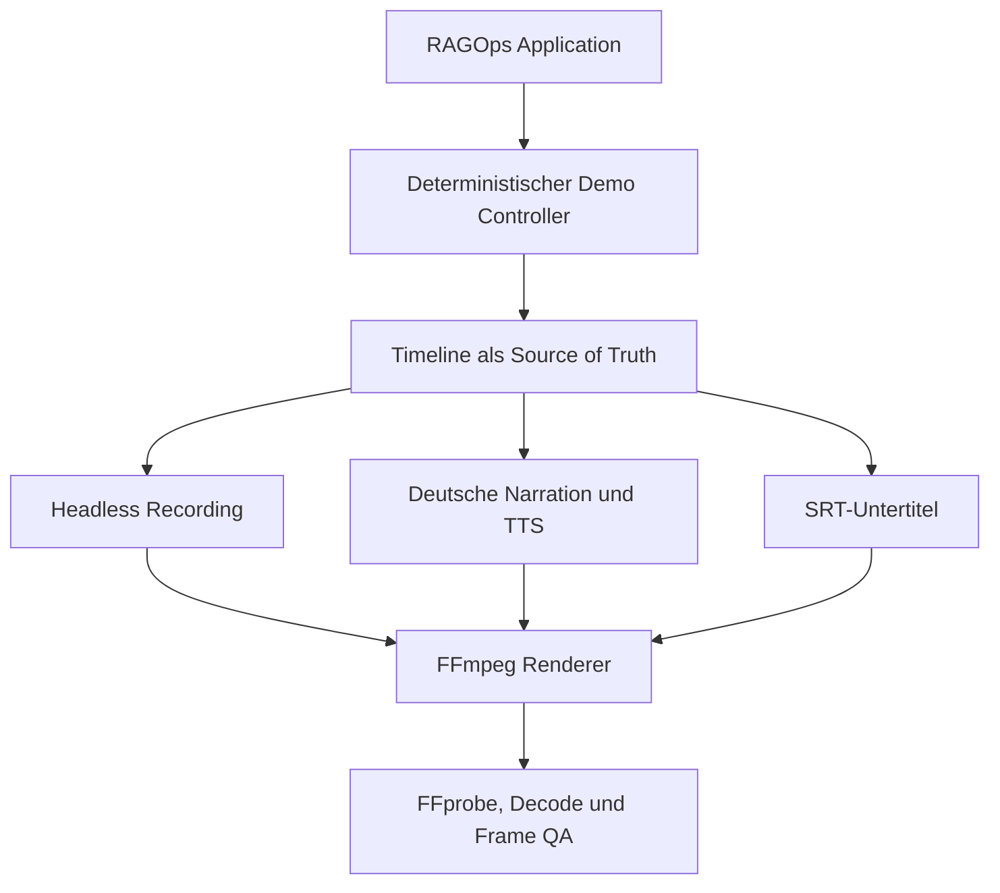
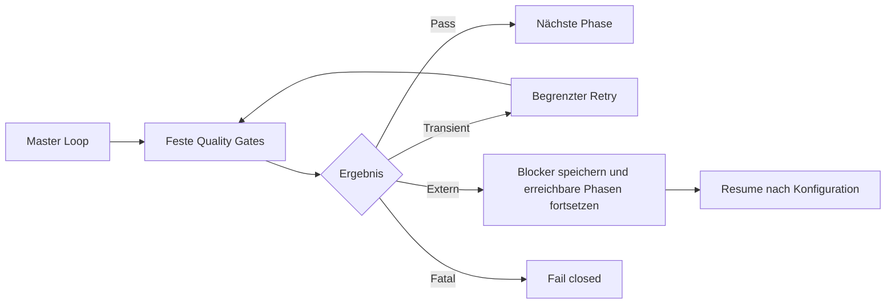

# Automation Architecture

## Zweck und Abgrenzung

Der Master-Loop in `automation/run_loop.py` orchestriert den
reproduzierbaren Application-, Demo- und Video-Build. Er ersetzt weder den
fachlichen RAG-Workflow noch den taskbasierten Codex-Controller in
`loop/controller.py`. Modelltext wird nicht als Kommando ausgewertet.



## Master-Zustandsmaschine



Die Reihenfolge ist in `automation/state.py` typisiert:

```text
DISCOVER -> PRECHECK -> PLAN -> IMPLEMENT -> STATIC_CHECK
-> UNIT_TEST -> INTEGRATION_TEST -> SECURITY_CHECK -> APPLICATION_QA
-> DEMO_PRECHECK -> DEMO_RUN -> RECORD -> GENERATE_NARRATION
-> GENERATE_VOICE -> GENERATE_SUBTITLES -> RENDER -> VIDEO_QA
-> FINAL_VERIFY -> COMPLETE
```

Übersprungene Rückwärts- oder Mehrphasenübergänge werden abgelehnt. Der Zustand
wird erst in eine temporäre Datei geschrieben und dann atomar ersetzt.

## Reale Application- und Demo-Pfade

`src/ragops/demo/controller.py` lädt die synthetische Wissensbasis über den
echten Ingestion- und Storage-Pfad. Er führt eine CRM-plus-Dokument-Anfrage und
einen Prompt-Injection-Fall über den produktiven Workflow aus. Fehlende Quellen,
nicht erkannte Injection oder ein unvollständiger Export brechen das Gate ab.

Für die Aufnahme startet `video/recording/capture.py` FastAPI und Streamlit
nur auf `127.0.0.1`. Dashboard-Szenen werden über eine feste Allowlist
gewählt. `answer` und `blocked` lösen echte API-Anfragen aus; Titel-
und Reportkarten werden aus Repository-Nachweisen erzeugt.

## Timeline und Medien

`video/script/timeline.json` definiert neun deutsche Szenen und 150 Sekunden
Gesamtdauer. Aus derselben Datei entstehen:

- `video/script/narration.md`
- szenenweise WAV-Dateien
- `video/tmp/subtitles.srt`
- Screenshots mit 1920 x 1080 Pixeln
- Szenensegmente und das finale MP4

TTS-Dateien werden anhand von Sprache, Modell, Stimme und Text gehasht. Nur
passende Cache-Dateien werden wiederverwendet.

## Security-Grenzen

- Repository-relative Pfade werden vor Verwendung auf Traversal geprüft.
- Aufnahmen und API-Priming sind auf lokale HTTP-Endpunkte beschränkt.
- Tools werden per absolut aufgelöstem Executable und Argumentliste gestartet.
- Shell-Auswertung, Desktop-Koordinaten, `sudo` und Host-Sandbox-Umgehungen
  kommen im Loop nicht vor.
- Logs enthalten feste Prozessausgaben, aber keine API-Schlüssel.
- Der TTS-Schlüssel wird nur aus der Prozessumgebung gelesen.
- Der finale Verifier prüft Secrets, `.env`-Dateien, synthetische Daten,
  Containerkonfiguration und hohe Bandit-Befunde.

## Retry, Recovery und Exit-Codes

| Wert | Standard |
|---|---:|
| Versuche pro Phase | 3 |
| globale Iterationen | 30 |
| Kommando-Timeout | 900 Sekunden |

Nur Display-, Recording-, Netzwerk- und Renderingfehler gelten als transient.
Tests, Security-Funde, Konfiguration und Video-QA scheitern ohne automatisches
Kaschieren. Exit-Code `10` bedeutet ausschließlich
`READY_EXCEPT_EXTERNAL_BLOCKER`; andere Fehler verwenden getrennte Codes
für Konfiguration, Tests, Security und Video.

`./run_loop.sh --resume` lädt den atomaren Zustand. Ist nur
`GENERATE_VOICE` wegen eines fehlenden Schlüssels blockiert und inzwischen
`OPENAI_API_KEY` gesetzt, wird ab Voice, Rendering und QA weitergearbeitet.

## Nachweise und Outputs

| Pfad | Inhalt |
|---|---|
| `automation/state/loop_state.json` | aktueller Zustand und Retry-Zähler |
| `automation/state/history.jsonl` | maschinenlesbare Phasenhistorie |
| `video/logs/` | begrenzte Tool- und Dienstlogs |
| `video/tmp/` | reproduzierbare Zwischenartefakte |
| `dist/build_report.md` | lesbarer Gesamtbericht |
| `dist/master_loop_report.json` | maschinenlesbarer Gesamtbericht |
| `dist/video_qa_report.json` | Codec-, Dauer-, Decode- und Frame-Prüfung |
| `dist/solcom_demo.mp4` | finales Video nur mit echter Sprecherstimme |
| `dist/solcom_demo_preview.mp4` | klar benannte Vorschau ohne Voice |

Generierte Zustände, Logs, temporäre Medien und `dist/` werden nicht
versioniert. Die überprüfbaren Application-Nachweise verbleiben unter
`evidence/`.
