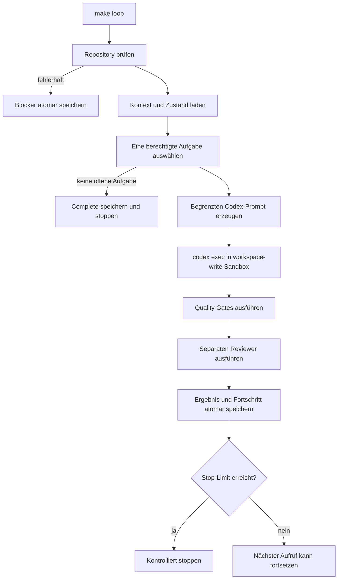

# Architektur des kontrollierten Codex-Loops

## Ziel

Der Controller in `loop/controller.py` stellt einen begrenzten,
wiederaufnehmbaren Entwicklungsprozess bereit. Er verbindet eine formal
beschriebene Aufgabe mit einem festen Codex-Aufruf, Quality Gates,
einem separaten Review und persistenten Zustandsdateien.

Der Loop ist kein allgemeiner Shell-Agent. Freitext aus einer Modellantwort wird
niemals als Kommando interpretiert oder auf dem Host ausgeführt.

## Komponenten

| Komponente | Aufgabe |
|---|---|
| `scripts/autonomous_build.sh` | Shell-Einstiegspunkt mit `set -euo pipefail` |
| `loop/controller.py` | Auswahl, Ausführung, Limits und Zustandsverwaltung |
| `AGENTS.md` | verbindliche Arbeits- und Sicherheitsregeln |
| `SPEC.md` | fachliche und technische Zieldefinition |
| `TASKS.yaml` | Aufgaben, Abhängigkeiten und Acceptance Criteria |
| `scripts/verify.py` | feste Quality Gates außerhalb der Modellantwort |
| `scripts/review.py` | separater Architektur- und Security-Review |
| `.loop/` | atomarer Zustand, Historie, Blocker und begrenzte Logs |

## Ablauf einer Iteration



Der Controller wählt genau eine Aufgabe, deren Status `pending` oder
`in_progress` ist und deren Abhängigkeiten abgeschlossen sind. Priorität und
Task-ID bestimmen eine reproduzierbare Reihenfolge.

## Fester Codex-Aufruf

Der Controller baut eine Argumentliste und verwendet keine Shell-Interpolation:

```bash
codex exec \
  --sandbox workspace-write \
  --ask-for-approval never \
  "<Aufgabe, Acceptance Criteria und erlaubte Dateibereiche>"
```

Der Prompt enthält die ausgewählte Aufgabe, Acceptance Criteria und erlaubte
Dateibereiche. Er fordert die kleinste vollständige Änderung und verbietet das
Umgehen von Tests oder Sicherheitskontrollen.

## Quality und Review außerhalb des Modells

Nach Codex werden nur fest definierte Kommandolisten ausgeführt:

```text
python scripts/verify.py --loop
python scripts/review.py
```

Der Controller liest keine Befehle aus stdout oder stderr. Ein Durchlauf ist nur
erfolgreich, wenn Codex, Quality Gates und Review jeweils Rückgabecode null
liefern. Fehler werden als strukturierte Blocker gespeichert.

## Persistenter Zustand

| Datei | Inhalt |
|---|---|
| `.loop/state.json` | Iteration, Fehlerzähler, Stillstand und letzter Erfolg |
| `.loop/history.jsonl` | strukturierte Folge der Durchlaufergebnisse |
| `.loop/current_task.json` | aktuell ausgewählte Aufgabe |
| `.loop/last_result.json` | letztes vollständiges Controller-Ergebnis |
| `.loop/blockers.json` | kontrolliert erfasste Blocker |
| `.loop/logs/` | begrenzte lokale, von Git ignorierte Logs |

JSON-Zustände werden zuerst in eine temporäre Datei im selben Verzeichnis
geschrieben, mit `fsync` persistiert und anschließend atomar ersetzt. Ein
Prozessabbruch hinterlässt dadurch keine teilweise geschriebene JSON-Datei.

## Konfigurierbare Grenzen

| Variable | Standard | Bedeutung |
|---|---:|---|
| `MAX_ITERATIONS` | 30 | maximale Zahl gespeicherter Iterationen |
| `MAX_CONSECUTIVE_FAILURES` | 3 | Stopp nach wiederholten Fehlern |
| `MAX_NO_PROGRESS_ITERATIONS` | 3 | Stopp bei wiederholtem Stillstand |
| `ITERATION_TIMEOUT_SECONDS` | 900 | Timeout je festem Kommando |
| `MAX_LOG_BYTES` | 1.000.000 | maximale Ausgabe pro Kommando |
| `MAX_NEW_PROD_DEPENDENCIES` | 2 | konfigurierte Obergrenze neuer Produktionsabhängigkeiten |

Die Dependency-Grenze ist im Konfigurationsmodell vorhanden. Dependency Audit
und Review laufen bereits als Quality Gates; die numerische Vorher-/Nachher-
Auswertung wird im aktuellen Controller jedoch noch nicht selbst erzwungen und
ist deshalb als verbleibende Härtungsaufgabe ausgewiesen.

## Sicherheitsmodell

- `workspace-write` begrenzt die Repository-Arbeit.
- `--yolo`, `danger-full-access` und `sudo` werden nicht verwendet.
- Modelltext wird nie als Shell-Code ausgewertet.
- Kommandos werden als feste Listen an `subprocess.run` übergeben.
- Jeder Prozess besitzt Timeout und begrenzte Logausgabe.
- Kritische Security-Funde, Fehlerfolgen und Stillstand führen zum Stopp.
- Der Controller prüft vor jeder Iteration den Git-Zustand.
- Erlaubte Dateibereiche werden aufgabenbezogen an Codex übergeben.
- Quality Gates und Reviewer laufen unabhängig von der Modellantwort.
- Echte Secrets und `.env`-Dateien sind ausgeschlossen.

## Bedienung

```bash
# Eine kontrollierte Iteration
make loop

# Persistenten Status anzeigen
make loop-status

# Nach einem kontrollierten Abbruch fortsetzen
make loop-resume

# Auswahl und Kommandos ohne Codex-Ausführung prüfen
python3 loop/controller.py dry-run
```

Ein Controller-Aufruf bearbeitet bewusst nur eine Aufgabe. Ein erneuter
`make loop-resume` startet die nächste Iteration. Das begrenzt die Wirkung eines
Modellaufrufs und erleichtert Review und Wiederanlauf.

## Nachweis und Interpretationsgrenze

Die versionierte `.loop/history.jsonl` enthält einen tatsächlich ausgeführten
Dry-Run, der Kontextladung, Task-Auswahl und feste Kommandos belegt. Die
fachlichen Phasen sind in `TASKS.yaml` abgeschlossen; Testergebnisse,
Evaluationen und Reviews liegen unter `evidence/`.

Diese Nachweise belegen Funktionsweise und Verwendung des Loop-Modells im
Entwicklungsprozess. Sie werden nicht als vollständig autonomer End-to-End-Lauf
aller Tasks dargestellt. Nicht ausgeführte Modellaktivität wird weder behauptet
noch durch erfundene Historieneinträge ersetzt.

## Tests

Die Unit-Tests prüfen unter anderem Task-Auswahl, Abhängigkeiten, exakte
Codex-Argumentliste, atomare Zustandsaktualisierung, Timeouts, Fehlerbehandlung,
Logbegrenzung, Stop-Bedingungen, Dry-Run und beschädigte Repositories. Sie sind
Bestandteil von `make verify` und GitHub Actions.
