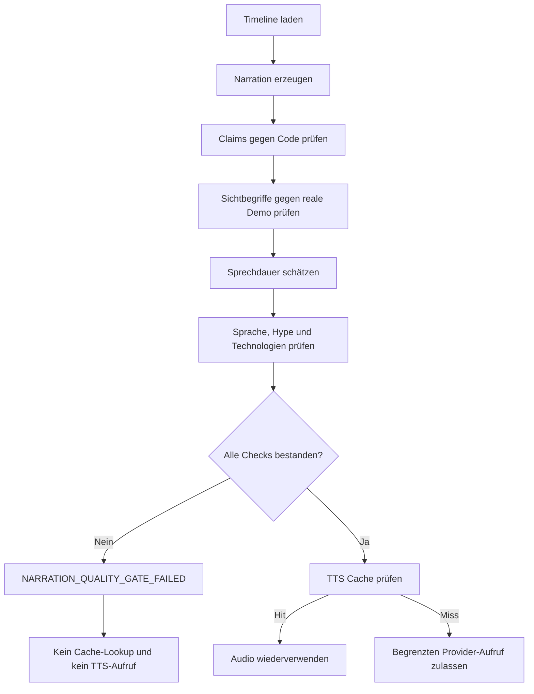

# Narration Quality Gate

## Zweck

Das Narration Quality Gate verhindert externe TTS-Aufrufe für fachlich
unbelegte, visuell unpassende oder zu lange Sprechertexte. Es läuft in
`video/pipeline.py` und als eigene Master-Loop-Phase
`VERIFY_NARRATION` zwingend vor `GENERATE_VOICE`.



## Timeline-Vertrag

Jede Szene in `video/script/timeline.json` enthält zusätzlich:

- `claims`: vollständige Zuordnung jedes Narrationssatzes zu Codebelegen,
- `evidence.path`: Repository-relativer, vorhandener Textpfad,
- `evidence.contains`: erwartetes Codefragment,
- `visual_terms`: mindestens zwei Texte, die in der sichtbaren Szene
  tatsächlich gerendert sein müssen.

Ein Claim ist nur gültig, wenn sein vollständiger Satz in der Narration steht
und jeder angegebene Beleg im aktuellen Repository gefunden wird. Absolute
Pfade, Symlinks, Pfade außerhalb des Repositorys und übergroße Belegdateien
werden abgelehnt.

## Prüfungen

| Check | Bedeutung |
|---|---|
| `claims_complete` | Jede Szene besitzt maschinenlesbare Claims |
| `all_sentences_covered` | Jeder Narrationssatz ist exakt einem Claim zugeordnet |
| `code_evidence_valid` | Alle referenzierten Implementierungsfragmente existieren |
| `demo_alignment_valid` | Reale DOM-Sichtprüfung entspricht den erwarteten Begriffen |
| `timing_valid` | Konservative Sprechschätzung passt in das Szenenbudget |
| `german_language_valid` | Timeline und Narration entsprechen dem deutschen Standard |
| `no_hype` | Keine absoluten oder werblichen Übertreibungen |
| `technical_terms_valid` | Keine bekannten, im Projekt nicht implementierten Technologien |
| `target_total_duration_valid` | Geplante Gesamtdauer liegt zwischen 120 und 180 Sekunden |

Die Zeitabschätzung verwendet sowohl Zeichen- als auch Wortdichte und wählt
den konservativeren Wert. Vor- und Nachpause zählen zum Szenenbudget.

## Reale Demo-Prüfung

`video/recording/capture.py` liest nach vollständigem Rendern den sichtbaren
`document.body.innerText` über Chrome DevTools. Der Build speichert nicht den
kompletten Seiteninhalt, sondern ausschließlich:

- Szenen-ID und allowlisteten Capture-Modus,
- Screenshot-Pfad und Dateigröße,
- erfolgreich gefundene `visual_terms`.

Das atomare Ergebnis liegt unter `video/tmp/capture-manifest.json`. Das
Narration-Gate vergleicht die Treffer exakt mit der Timeline. Damit genügt eine
veraltete oder inhaltlich falsche Aufnahme nicht für TTS.

## Timing und Schnitt

Die Vorabprüfung verhindert offensichtlich zu lange Texte ohne API-Kosten. Nach
TTS misst FFprobe zusätzlich die echte Dauer jedes validierten Audiosegments.
Der Renderer berechnet die Szene als:

```text
pause_before + vollständige Audiodauer + pause_after
```

Sprache wird nicht mehr auf `planned_duration` abgeschnitten. Zwischen Szenen
liegen standardmäßig 350 Millisekunden Video-`xfade` und Audio-`acrossfade`.
Die Übergangsdauer ist über `VIDEO_TRANSITION_SECONDS` auf 0,1 bis 1,0
Sekunden begrenzt.

## Untertitel

Die Pipeline erzeugt weiterhin ein synchronisiertes
`video/tmp/subtitles.srt`. Es ist standardmäßig ein separates Sidecar und
wird nicht in `dist/solcom_demo.mp4` eingebrannt:

```bash
VIDEO_BURN_SUBTITLES=false ./video/build_demo.sh
```

Nur die explizite Einstellung `VIDEO_BURN_SUBTITLES=true` aktiviert Burn-in.
Änderungen an dieser Option, Übergängen oder Encoding sind nicht Teil des
TTS-Cache-Keys und verursachen keine Voice-API-Aufrufe.

## Reports

Der reale Build schreibt `dist/narration_qa_report.json` mit:

- Status und Gate-Position,
- allen Einzelchecks,
- Anzahl Szenen, Claims und Belegreferenzen,
- geschätzter und geplanter Dauer,
- szenenweisen Ergebnissen und konkreten Fehlern.

Der Dry Run verwendet `video/tmp/dry-run-narration-qa.json` und prüft Code,
Claims, Sprache sowie Timing ohne Browseraufnahme und ohne API-Aufruf. Der reale
Build verlangt anschließend das tatsächliche Capture-Manifest.

## Bedienung

```bash
# Kostenfreie Vorabprüfung inklusive Narration-QA und Cache-Plan
./video/build_demo.sh --dry-run

# Reales Demo-Capture, Gate und ausschließlich vorhandene Voice-Caches
./video/build_demo.sh --cache-only

# Vollständiger cache-first Build
./video/build_demo.sh
```

Bei einem Gate-Fehler endet die Pipeline mit
`NARRATION_QUALITY_GATE_FAILED`. Ein TTS-Key wird dann weder benötigt noch
verwendet.

## Testnachweise

`tests/unit/test_narration_qa.py` deckt ab:

- gültige Claims, Codebelege und reale Sichtmanifest-Daten,
- fehlende oder erfundene Belege,
- Hype und Szenenüberlauf,
- vollständige Audiodauer inklusive Pausen,
- Vorpause per FFmpeg-`adelay`,
- weiche Audio-/Videoübergänge,
- standardmäßig nicht eingebrannte Untertitel.
