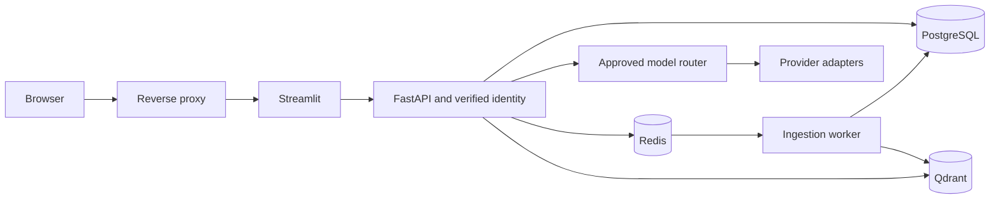

# Production architecture: target and current boundary

Current version: 0.2.0.dev0, development foundation. Production runtime remains
disabled until persistence, workers and all release gates pass.
See PRODUCTIZATION_AUDIT.md for observed baseline behavior and TASKS.yaml for
phase dependencies. The working deterministic RAG/demo path is retained.

The intended architecture is:

Implemented foundation: SQLAlchemy entity declarations, Alembic revision,
tenant-scoped repositories, strict admin tenant boundary, immutable identity
context, development identity boundary, asymmetric OIDC JWT validation, and
reusable FastAPI authentication/admin dependencies, asynchronous ingestion and
VectorIndex adapters with mandatory tenant filters. Live persistence and
external service integration remain deployment gates.

Pending: complete database-backed API/workspaces/history wiring, worker crash
recovery, live Qdrant verification, functional external
provider calls, deterministic model selection, budget reservations, rate limits,
backup/restore, retention, product UI, production topology and tagged release.

Authorization must precede retrieval, including vector search. Tenant and role
must originate from verified claims; request JSON and document front matter are
not authoritative. Composite foreign keys add a database tenant boundary but do
not replace verified identity, RBAC, or query scoping. All historical evaluation
and audit data need append permissions and retention policy before production.

No scaling or availability claims are made. The demo's in-process cache/metrics,
fixed synthetic date and hashed lexical vectors do not provide restart durability,
multiprocess aggregation or production semantic retrieval evidence.

Qdrant is isolated behind `VectorIndex`; production queries carry mandatory
tenant, authorization-scope, lifecycle and validity filters in the Qdrant
request itself. The Phase 10H RC Qdrant service is a separate ephemeral
verification target with tmpfs storage and no persistent volume. It does not
represent production durability configuration.
