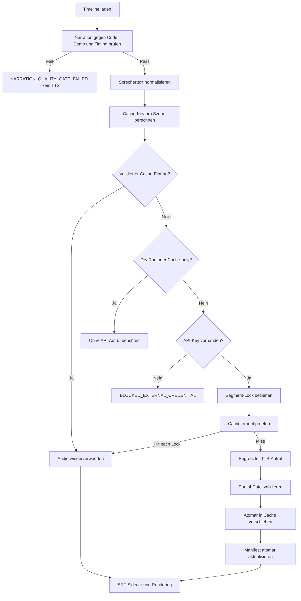

# Sicherer TTS-Cache und API-Kostenkontrolle

## Zweck

Die Demo-Video-Pipeline erzeugt deutsche Voiceover-Segmente ueber die OpenAI
Text-to-Speech API. Der Standardpfad ist immer Cache-first: Ein API-Aufruf ist
nur zulaessig, wenn fuer ein Segment kein validierter Cache-Eintrag existiert.
Automatisierte Tests verwenden ausschliesslich einen lokalen Fake-Provider.

## Sicherheitsgrenze

Der API-Key wird nur zur Laufzeit aus `OPENAI_API_KEY` gelesen. Er wird weder
serialisiert noch an Cache-Key, Manifest, Logs, Reports, Screenshots oder Video
uebergeben. Fehlt die Variable, wird der OpenAI-Client nicht konstruiert.

Die Redaction in `video/narration/tts.py` entfernt Key-aehnliche Werte und
Authorization-Bearer-Header aus Provider-Exceptions. Der zentrale Verifier
prueft zusaetzlich:

- lokale `.env*`-Dateien ausser `.env.example`,
- verbotene durch Git versionierte Secret-Dateinamen,
- Key- und Authorization-Muster im Repository,
- vollstaendig redigierte statt angeschnittener Finding-Werte.

Ein echter Key gehoert in die Prozessumgebung oder einen externen Secret Store,
nie in das Repository.

## Ablauf



Das verpflichtende Narration-Gate liegt vor dem Cache und ist in
[NARRATION_QA.md](NARRATION_QA.md) beschrieben. Dadurch entstehen weder
Cache-Planung noch API-Kosten für ungeprüften Sprechertext.

Caching liegt oberhalb des Providers. `OpenAITTSProvider` kennt keine
Cache-Pfade; `TTSCache` kennt weder API-Key noch OpenAI-Client.

## Content-addressable Key

Der SHA-256-Key wird aus deterministisch serialisierten TTS-Eingaben gebildet:

- normalisierter Sprechertext,
- Sprache,
- Provider,
- Modell,
- Stimme,
- Speech Instructions,
- Audioformat,
- Sprechgeschwindigkeit,
- `CACHE_SCHEMA_VERSION`.

Videoaufloesung, FPS, Encoding, Overlays, Untertitelstil, Schnitt und Uebergaenge
sind bewusst nicht enthalten. Reine Videoaenderungen invalidieren daher kein
Voiceover. `OPENAI_API_KEY` ist technisch nicht Teil des Payloads.

## Persistenz und Manifest

Lokale Struktur:

```text
video/cache/tts/
|-- manifest.json
|-- .locks/
|-- <sha256>.wav
`-- ...
```

Der Pfad wird von Git ignoriert und von normalen Builds sowie `make clean`
nicht geloescht. Das Manifest speichert Dateiname, Provider, Sprache,
Erstellungszeit, Text-Hash, Dauer und Dateigroesse. Der vollstaendige
Sprechertext und Credentials werden nicht gespeichert.

## Audio-Validierung

Vor jedem Hit und vor jedem Commit prueft `AudioValidator`:

1. regulaere Datei ohne Symlink,
2. konfigurierbare Mindestgroesse,
3. Dekodierbarkeit mit FFprobe,
4. erwartetes Containerformat,
5. positive Dauer.

Ist FFprobe nicht vorhanden, existiert nur fuer WAV ein Standardbibliothek-
Fallback. Der normale Video-Precheck verlangt FFprobe. Defekte Eintraege werden
als `CACHE CORRUPT` behandelt und nur fuer die betroffene Szene ersetzt.

Neue Antworten werden unter einem zufaelligen `.partial-*`-Namen geschrieben,
validiert und danach mit `os.replace` atomar uebernommen. Partial-Dateien werden
auch im Fehlerfall entfernt. Ein `fcntl`-Lock pro Hash verhindert doppelte
Aufrufe konkurrierender lokaler Prozesse; ein eigener Manifest-Lock verhindert
verlorene Manifest-Updates.

## Kostenkontrollen

Vor dem ersten moeglichen Request zeigt die Pipeline:

```text
TTS CACHE SUMMARY
Segments:          9
Cache hits:        8
Cache misses:      1
API calls needed:  1
Characters:        154
```

`TTS_MAX_API_CALLS_PER_BUILD` ist standardmaessig `20`. Liegen mehr Misses
vor, endet der Lauf vor dem ersten Provider-Aufruf mit
`TTS_SAFETY_LIMIT_REACHED`. Tatsaechliche Retry-Versuche zaehlen ebenfalls
gegen dieses Limit. `MAX_TTS_RETRIES` ist standardmaessig `2`; nur Timeouts,
Verbindungsfehler, HTTP 408/409/429 und Serverfehler sind retryfaehig.

Es wird keine Kostensumme behauptet, weil ohne versionierte, aktuelle
Preisinformation keine belastbare Berechnung moeglich ist. Reports enthalten
stattdessen Segmente, Zeichen, erforderliche Aufrufe und tatsaechliche Requests.

## Betriebsmodi

```bash
# Nur Konfiguration, Timeline und Cache pruefen; niemals API aufrufen
./video/build_demo.sh --dry-run

# Nur validierten Cache verwenden; bei Miss mit Exit-Code 11 enden
./video/build_demo.sh --cache-only

# Normaler Cache-first-Build
./video/build_demo.sh

# Bestehende Eintraege bewusst ignorieren; kann neue Kosten verursachen
./video/build_demo.sh --force-tts

# Nur temporaere Videoartefakte loeschen; TTS-Cache bleibt erhalten
./video/build_demo.sh --clean-temp

# TTS-Cache ausschliesslich auf expliziten Benutzerbefehl leeren
./video/build_demo.sh --clear-tts-cache
```

`--dry-run`, `--cache-only`, `--skip-tts` und `--force-tts` sind
gegenseitig exklusiv. Der Master-Loop verwendet `--force-tts` nie automatisch.

## Status und Recovery

| Situation | Voice-Status | API-Aufrufe | Rendering |
|---|---|---:|---|
| kompletter Cache, Key fehlt | `PASS` | 0 | final |
| Cache-Miss, Key fehlt | `BLOCKED_EXTERNAL_CREDENTIAL` | 0 | nicht ausgefuehrt |
| Cache-only mit Miss | `CACHE_MISS` | 0 | nicht ausgefuehrt |
| Dry Run | `DRY_RUN` | 0 | nur geprueft |
| explizites Skip-TTS | `SKIPPED_EXPLICITLY` | 0 | stumme Vorschau |
| Cache-Miss mit Key | `PASS` | nur Misses/Retry | final |

Nach einem externen Blocker startet `./run_loop.sh --resume` wieder bei
`GENERATE_VOICE`. Ein inzwischen vollstaendiger Cache reicht dafuer auch ohne
Key aus. Der Loop leert den Cache nie selbststaendig.

## Konfiguration

```text
OPENAI_API_KEY=
VIDEO_LANGUAGE=de
TTS_PROVIDER=openai
TTS_MODEL=gpt-4o-mini-tts
TTS_VOICE=coral
TTS_SPEECH_INSTRUCTIONS=
TTS_AUDIO_FORMAT=wav
TTS_SPEAKING_SPEED=1.0
TTS_MAX_API_CALLS_PER_BUILD=20
MAX_TTS_RETRIES=2
TTS_MIN_AUDIO_BYTES=256
```

`.env.example` enthaelt nur leere oder synthetisch sichere Werte. Das Projekt
laedt keine reale `.env` automatisch.

## Testnachweise

`tests/unit/test_tts_cache.py` simuliert ohne Netzwerk:

- erster Build mit vollstaendigen Misses,
- zweiter Build mit vollstaendigen Hits,
- genau eine geaenderte Szene,
- reine Videoaenderungen,
- kompletter Cache ohne Key,
- korrupte Audiodatei,
- geaenderte Stimme und geaenderten Text,
- Dry Run und Cache-only,
- API- und Retry-Limits,
- Force-Modus,
- Manifest-Datenminimierung,
- Ausschluss des Keys aus Cache-Material und Redaction.

Maschinenlesbare Laufzeitwerte stehen in
`video/tmp/tts-cache-report.json`, im Video-Build-State und in den
Master-Loop-Berichten unter `dist/` und `evidence/`.
